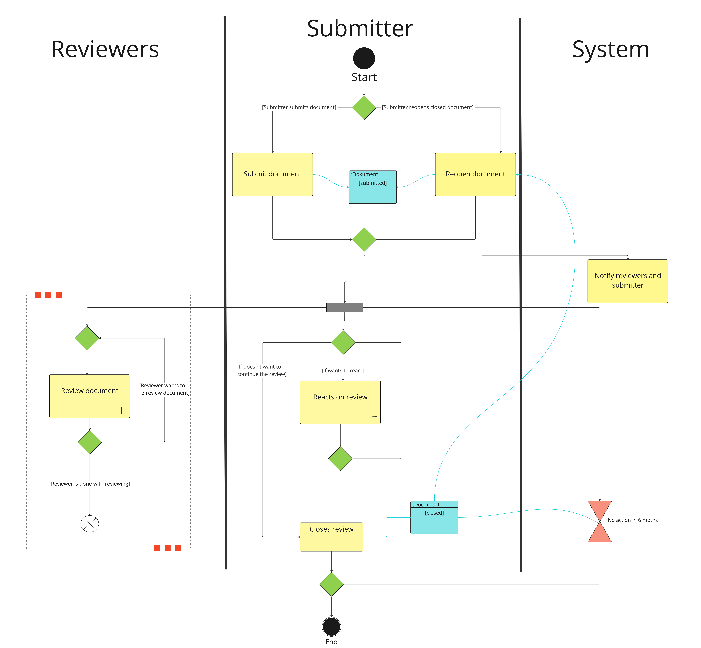
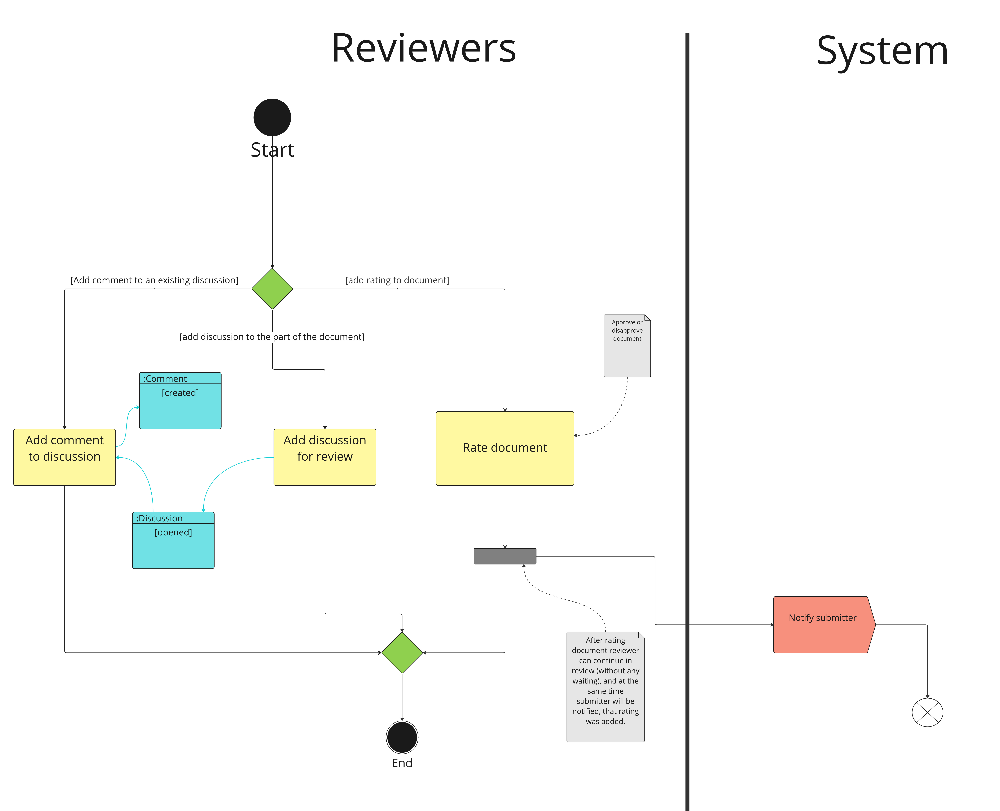
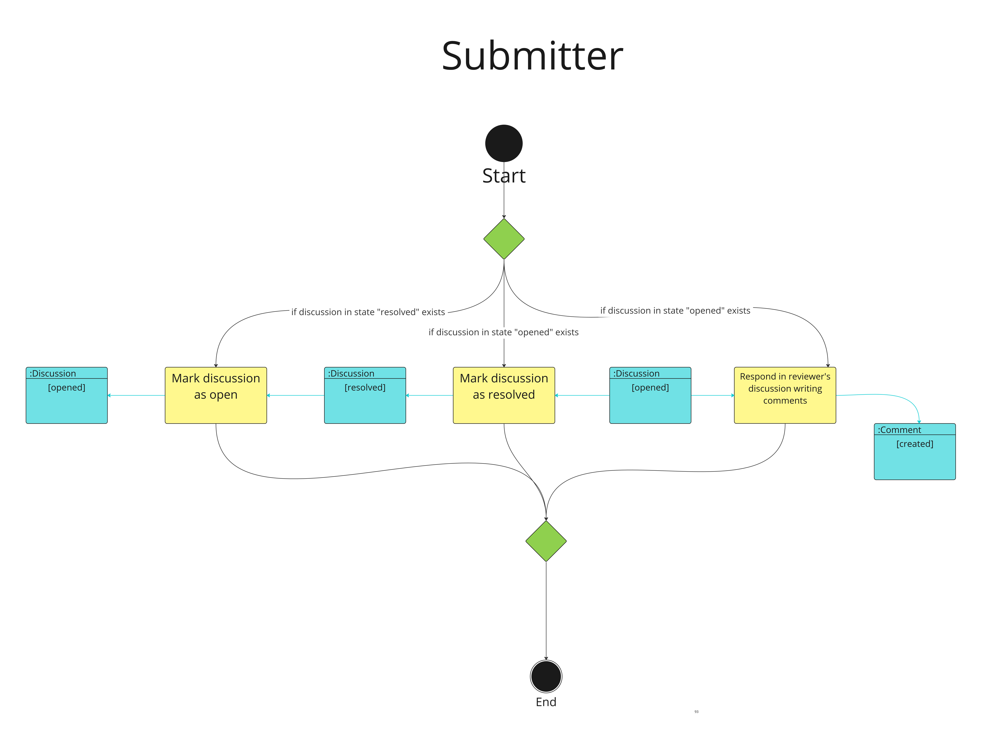

# 1. Application Business Processes

Our application will execute a single process, described in detail below.

## 1.1 Creating a Document Review, Starting a Conversation, Evaluating the Document, and Closing the Review

This process describes the entire lifecycle of a document in our application. The first step is the creation of a document by the project administrator (here referred to as the submitter, who may also be one of the project’s authors). The submitter creates the document based on a request from the Data Stewardship Wizard by sending it to the Submission Services (SS).
Afterwards, reviewers evaluate the document (Review Document). They can add discussions to it and participate in discussions opened by other reviewers, leaving their opinions. They can also provide a final evaluation of the entire document.
The submitter can communicate with the reviewers (Reacts on Review) until they decide to close the document review (Closes Review). Once closed, no further interaction with the document is possible.
The process may start again if the submitter decides to reopen the document and continue the review.

### 1.1.1 Reviewer Interaction with the Documen

A reviewer can add a discussion thread to the document, reply within an existing thread, or provide a rating for the document. When a rating is submitted, a notification is sent to the submitter.

### 1.1.2 Submitter Interaction with the Document

If there is a discussion thread in the opened state, the submitter can add a comment to that thread. This creates a new comment in the created state.
The submitter can also mark the thread as resolved, which prevents any further replies or comments.
If a thread is in the resolved state, the submitter can revert it back to opened, allowing additional discussion within that thread.

