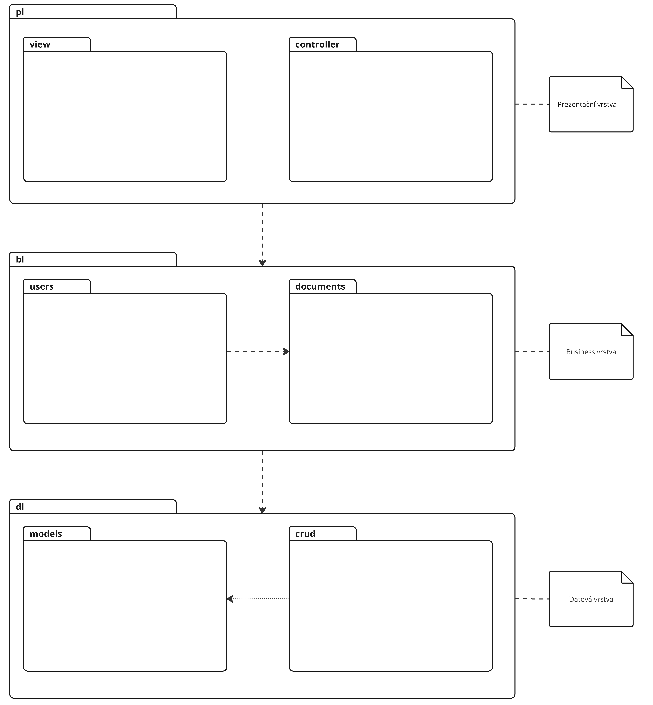

# Architecture Design
The application architecture is designed as a three-layer model. The interfaces between individual layers will be defined using interfaces. The exact definition of these interfaces will be specified during the implementation of the first version of the application.
Using interfaces will allow easy replacement of individual layers. The architecture diagram is shown in the figure below.

For the implementation of the application backend, we use the Python programming language and the FastAPI framework.
In this project, we primarily use the IoC (Inversion of Control) pattern, which allows linking individual components (classes) in a declarative way within the application configuration. This enables easy replacement of certain parts without modifying the source code, which is useful for example during testing.

Used Libraries and Frameworks

- Dependency injection (IoC) – [FastAPI](https://fastapi.tiangolo.com/)
- Data persistence (ORM) – [SQLAlchemy](https://www.sqlalchemy.org/)
- User interface (GUI) – [Angular](https://angular.io/)
- Testing – [pytest](https://docs.pytest.org/en/7.3.x/)
- Package management – [conda](https://docs.conda.io/en/latest/)

