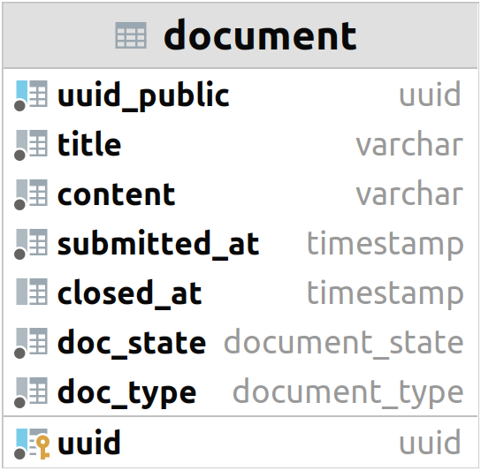

# Relational Data Model

For the second iteration, the database model is still very simple. It contains only a single entity: **document**.
Users can perform limited operations with documents.

The application uses the SQLAlchemy [library](https://www.sqlalchemy.org/) to work with the database.
